# Day 2 — Visual Reference: Advanced Object Modelling

---

## 01 — `__repr__`, `__str__`, `__eq__`

### Python string-representation dispatch chain

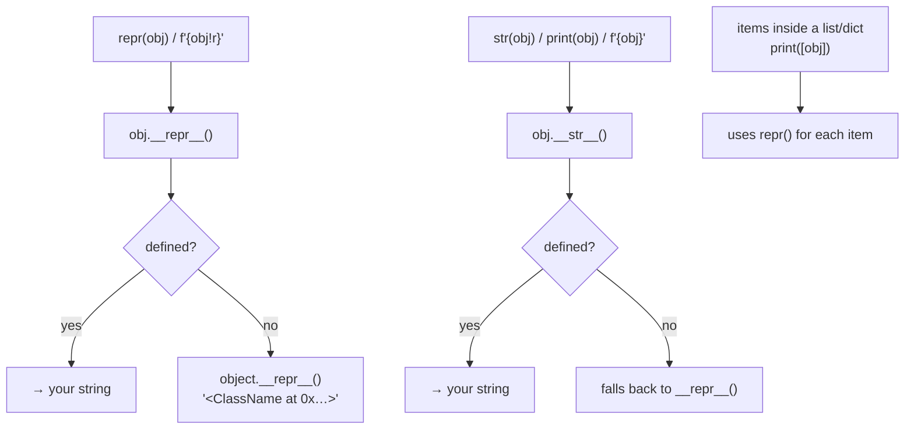

### Equality dispatch chain

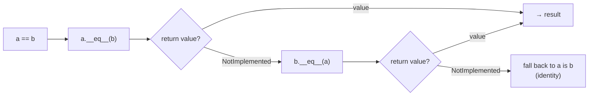

### Before vs. After

| | No dunders | With `__repr__` + `__eq__` |
|---|---|---|
| `repr(obj)` | `<JobRunDefault object at 0x7f…>` | `JobRun(job_id='job-101', status='success', …)` |
| `print(obj)` | same as repr | `[SUCCESS] Job job-101 — 4500 records` |
| `obj1 == obj2` | `False` (identity) | `True` (field-by-field) |
| usable in set? | ❌ | ✅ (with `__hash__` too) |

---

## 02 — `@dataclass` Basics

### What `@dataclass` generates automatically

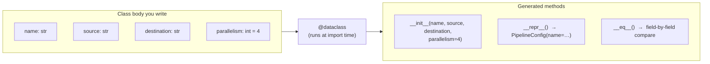

### Manual class vs. @dataclass — line count

```
PipelineConfigManual                PipelineConfig
─────────────────────────────       ─────────────────────────────
def __init__(self, ...):   6 lines  @dataclass
    self.name = name                class PipelineConfig:
    self.source = source                name: str
    ...                                 source: str
                                        destination: str
def __repr__(self):        8 lines      parallelism: int = 4
    return (...)

def __eq__(self, other):   8 lines  ← 5 lines total, same behaviour
    ...

Total: ~22 lines boilerplate
```

### `@dataclass` and `__hash__`

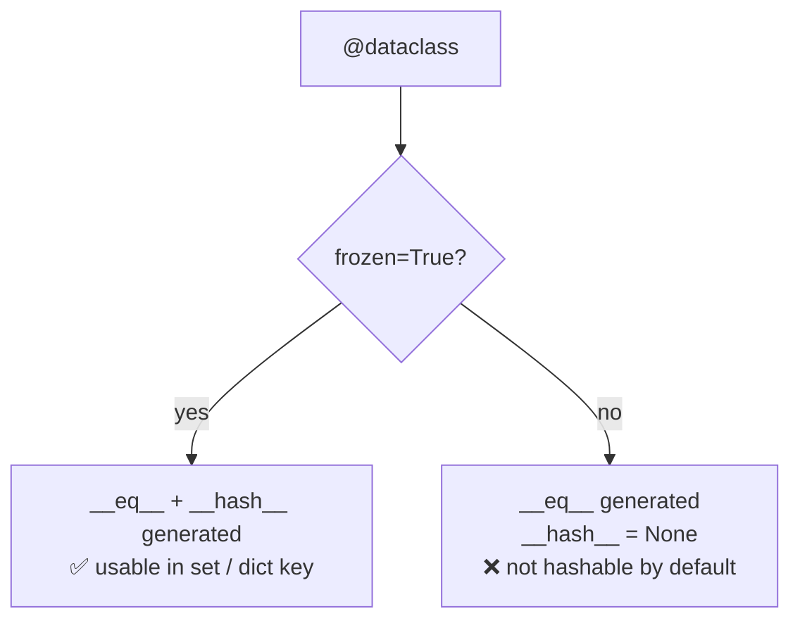

---

## 03 — Dataclass Field Defaults

### The mutable default trap

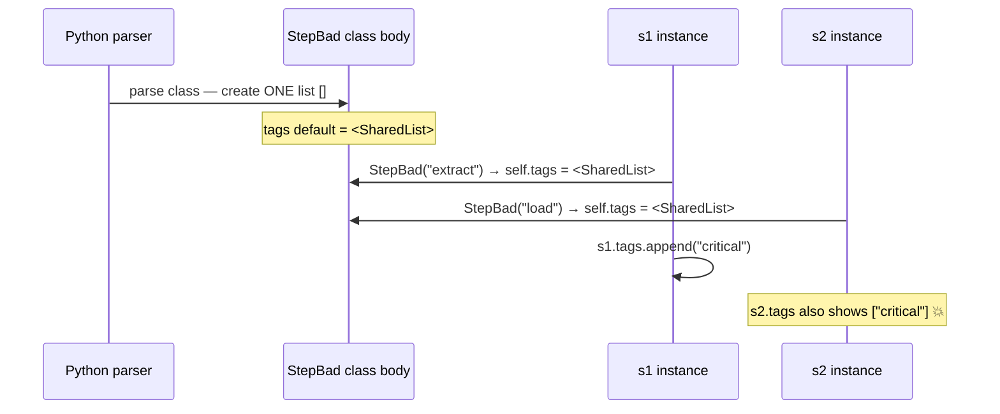

### `field(default_factory=list)` — correct pattern

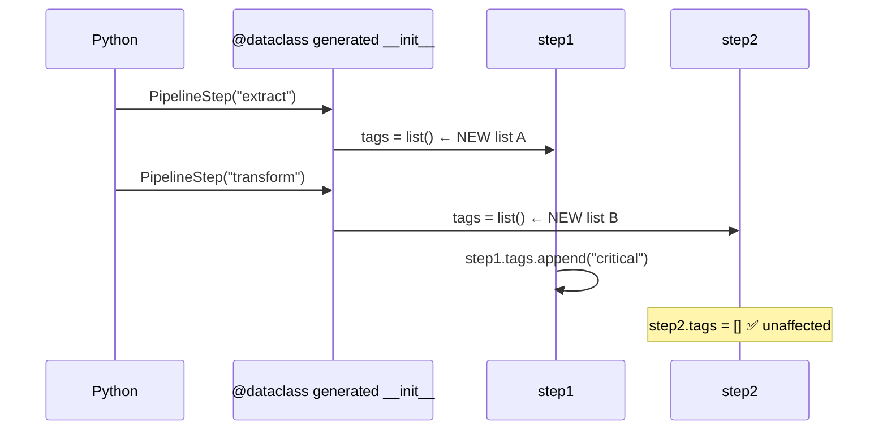

### `field()` options reference

| Option | Effect | Use case |
|---|---|---|
| `default=v` | sets a fixed default value | scalars, constants |
| `default_factory=fn` | calls `fn()` per instance | lists, dicts, sets |
| `repr=False` | hides field from `__repr__` | large blobs, secrets |
| `init=False` | removes from `__init__` | computed/managed state |

### `frozen=True` effects

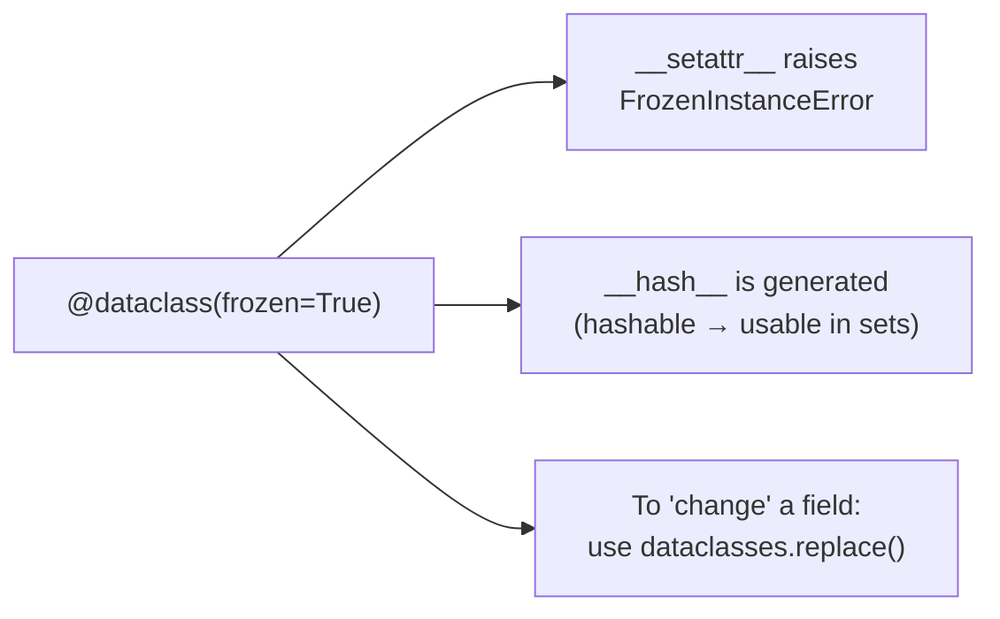

### `dataclasses.replace()` — copy-with-overrides

```
base = JobConfig("etl_daily")           # parallelism=4, timeout=300

replace(base, parallelism=16)
  ┌──────────────────────────────────┐
  │  name          = "etl_daily"  (copied)
  │  parallelism   = 16           (overridden)
  │  timeout_sec   = 300          (copied)
  │  retry         = True         (copied)
  └──────────────────────────────────┘
  → new JobConfig object   (base is UNCHANGED)
```

---

## 04 — Properties: Advanced

### Three property patterns side-by-side

```
PART 1: Computed (read-only)        PART 2: Validated setter           PART 3: Canonical store
────────────────────────────        ─────────────────────────          ────────────────────────
  _start ─┐                           self.hz = 100                      "  TRIP_DISTANCE  "
  _end   ─┴─► duration_sec               │                                       │
               (derived)              @hz.setter                         @name.setter
               no setter ─► AttributeError  │                             strips + lower
                             type check ─┘  │                             "trip_distance" → _name
                             range check    │                                  │
                             store _hz ◄───┘                           display_name property
                                                                        title-cases on read
```

### PART 1 — Computed property flow

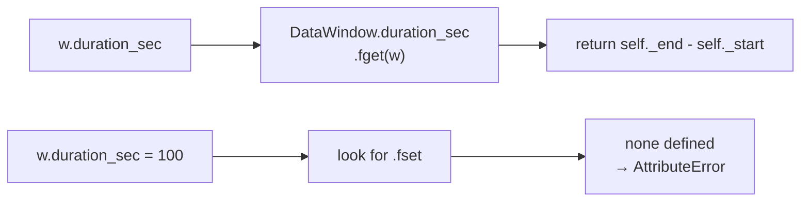

### PART 2 — Validation setter flow

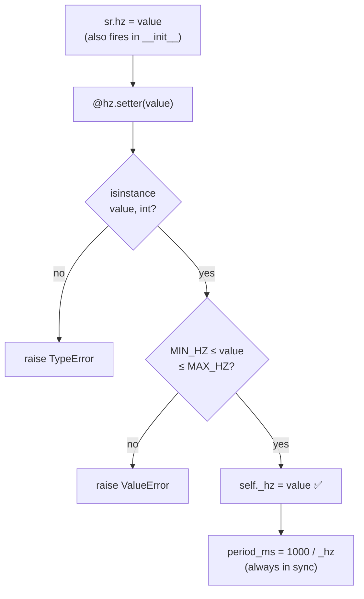

### PART 3 — Stored vs. presented flow

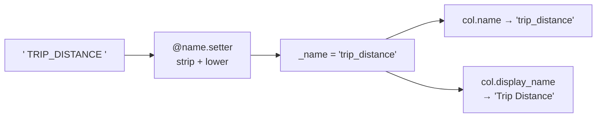

### PART 4 — `__post_init__` in a dataclass

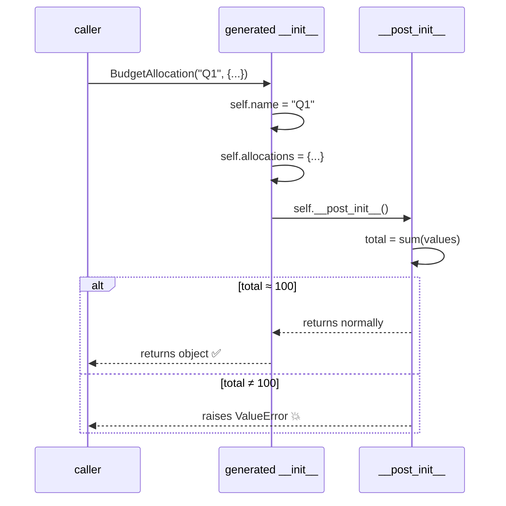

---

## 05 — Context Managers

### The `with` statement protocol

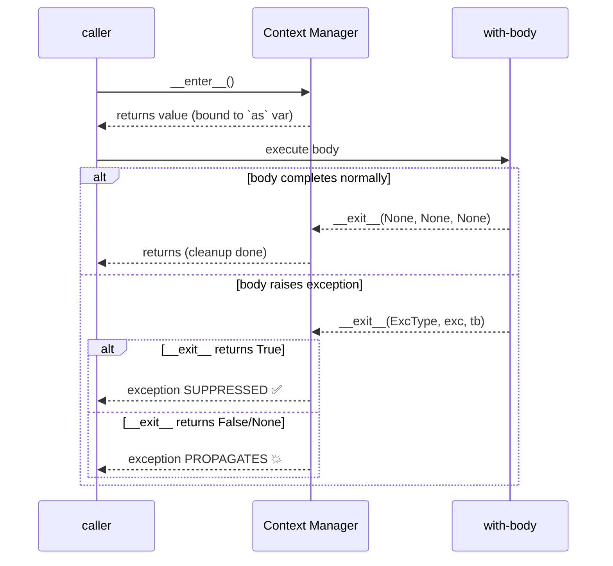

### Class-based vs. `@contextmanager`

```
CLASS-BASED                         @contextmanager (generator)
───────────────────────             ───────────────────────────
class ManagedConnection:            @contextmanager
    def __enter__(self):            def managed_file_writer(path):
        open connection                 # === __enter__ ===
        return self                     handle = open(path, "w")
                                        try:
    def __exit__(self,                      yield handle   ← bound to `as`
            exc_type, exc_val,          finally:
            exc_tb):                        # === __exit__ ===
        close connection                    handle.close()
        return False
```

### Exception suppression in `__exit__`

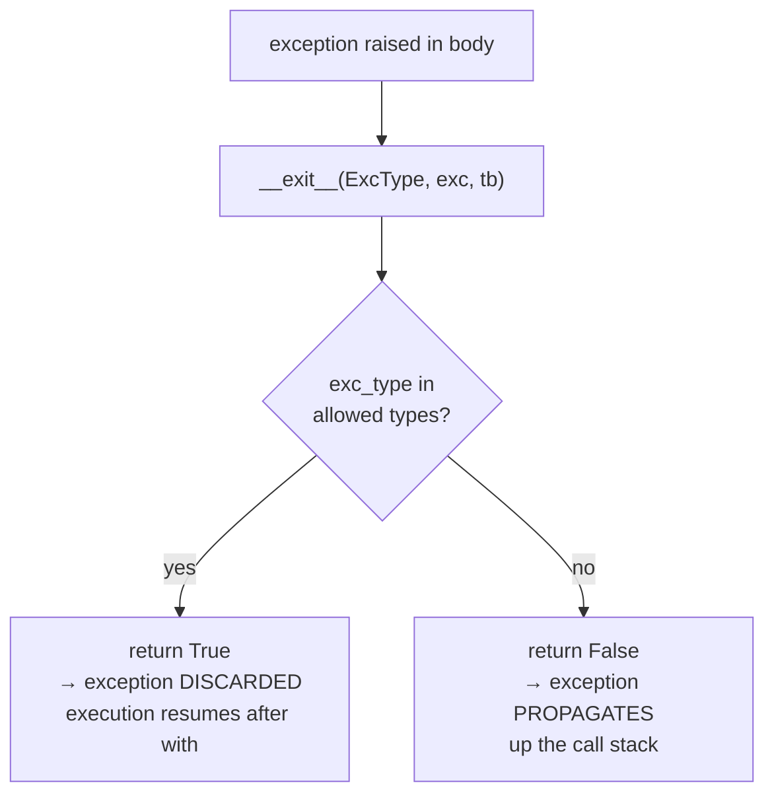

---

## 06 — Function Decorators

### The decorator pattern — what happens at definition time

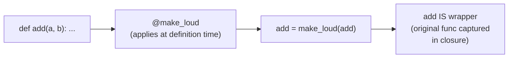

### Call flow after decoration

```
add(3, 4)
  │
  ▼ wrapper(3, 4)          ← 'add' now refers to wrapper
    │
    ├─► print "→ calling add"
    │
    ├─► result = func(3, 4)  ← original add, captured by closure
    │       └─► returns 7
    │
    ├─► print "← add returned 7"
    │
    └─► return 7
```

### `functools.wraps` — what it copies

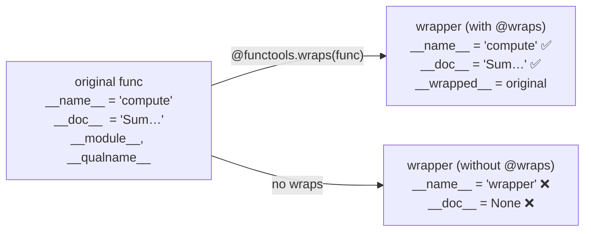

### Decorator factory — three nesting levels

```
retry(max_attempts=3)         ← level 1: factory — configures the decorator
  └─► returns decorator(func) ← level 2: decorator — wraps the function
        └─► returns wrapper()  ← level 3: wrapper — runs on each call

@retry(max_attempts=3)
def flaky_fetch(url): ...

# equivalent to:
# flaky_fetch = retry(max_attempts=3)(flaky_fetch)
```

### Stacking decorators — application order

```
@log_call          ← applied SECOND (outermost)
@timing            ← applied FIRST  (innermost)
def process_batch(...): ...

# equivalent to:
# process_batch = log_call(timing(process_batch))

Runtime call order (top-down):
  process_batch(...)
    → log_call's wrapper     (prints CALL)
      → timing's wrapper     (starts timer)
        → original function  (does work)
      ← timing's wrapper     (prints elapsed)
    ← log_call's wrapper     (prints OK / ERROR)
```

---

## 07 — Class Decorators

### Class decorator flow

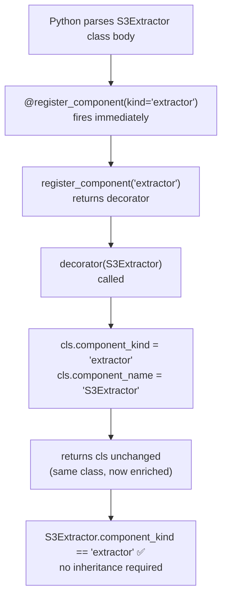

### Three class decorator patterns

```
PATTERN 1: Add metadata          PATTERN 2: Inject a method       PATTERN 3: Enforce convention
─────────────────────────        ──────────────────────────        ────────────────────────────
@register_component("ext")       @add_describe                     @require_docstring
class S3Extractor: ...           class RunSummary: ...             class ValidatedStep: ...
  │                                │                                  │
  ▼                                ▼                                  ▼
stamps cls.component_kind        injects describe()                checks cls.__doc__
no inheritance needed            into class at def-time            raises TypeError BEFORE
                                 works like a regular method       any instance is created
```

### Class decorator vs. inheritance

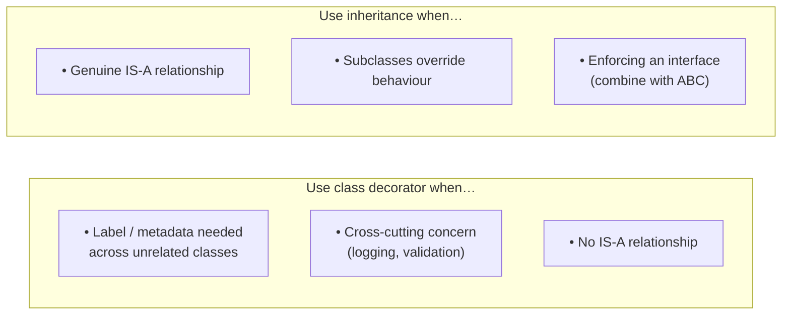

---

## 08 — `__init_subclass__` Registry

### When does `__init_subclass__` fire?

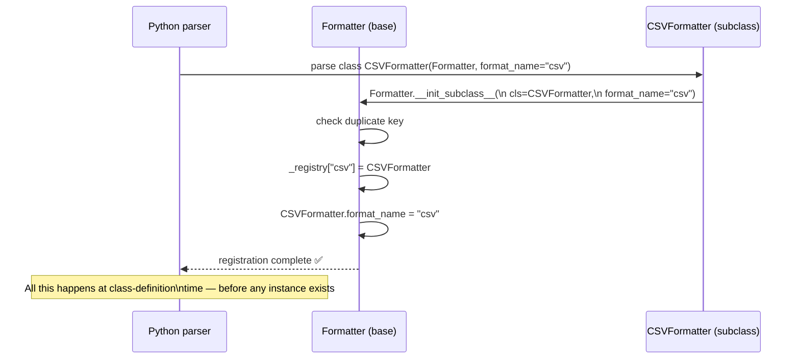

### Registry state after all subclasses are defined

```
Formatter._registry
┌──────────────┬─────────────────────┐
│ "csv"        │ CSVFormatter        │
│ "json"       │ JSONFormatter       │
│ "markdown"   │ MarkdownFormatter   │
└──────────────┴─────────────────────┘

Formatter.get("csv")
  → looks up "csv" in _registry
  → finds CSVFormatter
  → calls CSVFormatter()
  → returns a fresh instance
```

### Key properties of the pattern

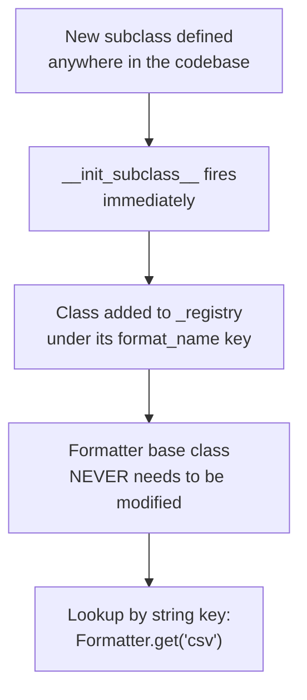

### Comparison — manual registration vs. `__init_subclass__`

| | Manual registry | `__init_subclass__` |
|---|---|---|
| Where to register? | explicit `register(MyClass)` call | defining the class is enough |
| Forget to register? | ✅ easy to forget | ❌ impossible to forget |
| Base class changes? | must add registrar | never needs to change |
| Works across modules? | only if module is imported | same — must import the module |
| Duplicate detection? | manual | built-in (can add check) |

---

## 09 — Combined Modeling Demo

### How all Day 2 techniques compose

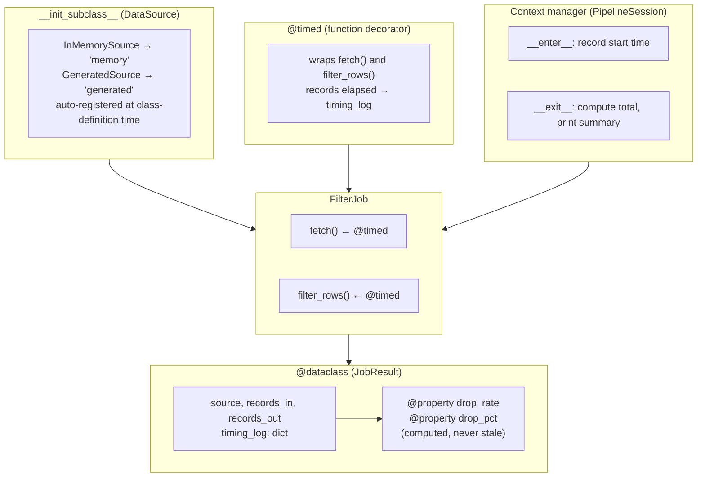

### Full execution flow — one pipeline run

```mermaid
sequenceDiagram
    participant caller
    participant session as PipelineSession (ctx mgr)
    participant job as FilterJob
    participant source as GeneratedSource
    participant result as JobResult (@dataclass)

    caller->>session: with PipelineSession("etl") as session
    session->>session: __enter__() — record start

    caller->>job: job = FilterJob(session)
    Note over job: timing_log shared with session

    caller->>job: job.run(source, min_value=7.5)

    job->>job: fetch(source)  ← @timed starts timer
    job->>source: source.fetch()
    source-->>job: raw rows
    job->>job: @timed stores timing_log["fetch"]

    job->>job: filter_rows(raw, 7.5)  ← @timed
    job->>job: filter by value >= 7.5
    job->>job: @timed stores timing_log["filter_rows"]

    job->>result: JobResult(source, records_in, records_out,\n             timing_log=...)
    result-->>job: instance with computed drop_rate

    job-->>caller: result
    caller->>session: exit with block
    session->>session: __exit__() — compute total ms
```

### Technique map

| Technique | Where in demo | Key behaviour |
|---|---|---|
| `@dataclass` | `JobResult` | auto `__init__`, `__repr__`, `__eq__`; `default_factory` for `timing_log` |
| `@property` | `drop_rate`, `drop_pct` | computed from `records_in/out`, never stale |
| Context manager | `PipelineSession` | `__enter__`/`__exit__`; cleans up even on error |
| Function decorator | `@timed` on `FilterJob` methods | wraps instance methods; duck-types `timing_log` |
| `__init_subclass__` | `DataSource` base | `InMemorySource` and `GeneratedSource` self-register |
